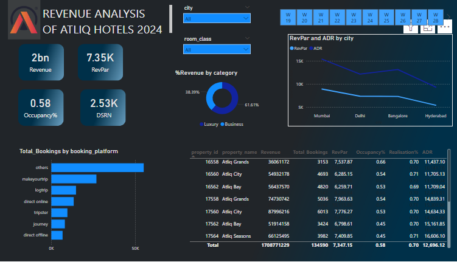
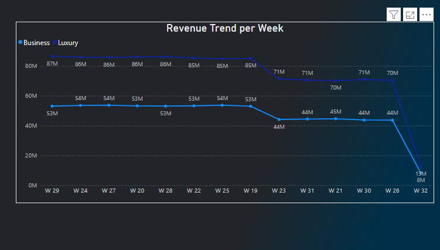
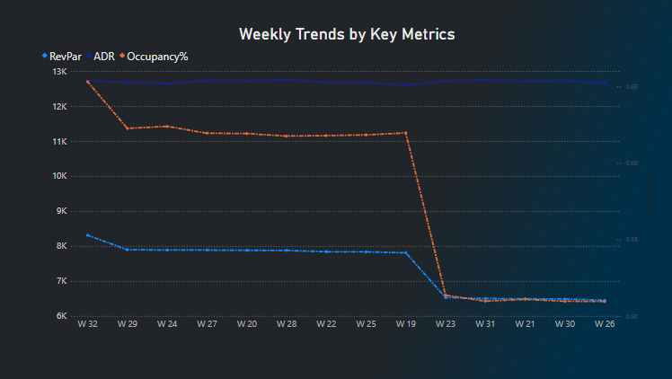

## ANALYSIS DASHBOARD OF ATLIQ REVENUE TREND PREVIEW:

*  Below is a preview of the dashboard created from the historical data given, to protray revenue trend and data insights extracted.

  
  
  

 
 
 
 
 # 🏘 REVENUE ANALYSIS OF ATLIQ HOTELS

AtliQ Grands owns multiple five-star hotels across India. 
They have been in the hospitality industry for the past 20 years. Due to strategic moves from other competitors and ineffective decision-making in management, AtliQ Grands are losing its market share and revenue in the luxury/business hotels category. 
As a strategic move, the managing director of AtliQ Grands wanted to incorporate “Business and Data Intelligence” to regain their market share and revenue. However, they do not have an in-house data analytics team to provide them with these insights.

Their revenue management team had decided to hire a 3rd party service provider to provide them with insights from their historical data.

  

### Objective

The goal of this project is to:

1. Develop key performance metrics based on the provided metric list.

2. Design and implement an interactive dashboard in Power BI showcasing trends across 15 hotel branches located in five cities.

3. Generate additional insights beyond the provided metrics and mock-up dashboard to support strategic decision-making.

## DATA TOOLS INVOLVED:

1. **Excel** - This was used for data cleaning, preprocessing and data exploration.
2. **PowerBI** - This was used to create a data visualizations that communicated the data insights extracted from the given historical data.
3. **DAX (Data Analysis Expressions)** - This was used to calculate the company metrics required to be protrayed as Key Performance Indicators of the revenue trend. This was done using *Calculated columns* and *Calculated measures*.

## DATA PROCESSES INVOLVED:
*  Discussion with company stakeholders
*  Creation of Mock dashboard
*   Data cleaning and Data standardization
*   Metrics Calculation
*   Data Analysis
*   Dashboard creation
*   Stakeholder discussion for dashboard adjustments
*   Deployment

## Conclusion

This project provided AtliQ Grands with an in-depth analysis of their revenue trends and actionable insights to regain market share. By leveraging data analytics, AtliQ Grands can make informed decisions and maintain a competitive edge in the luxury/business hotel category.
